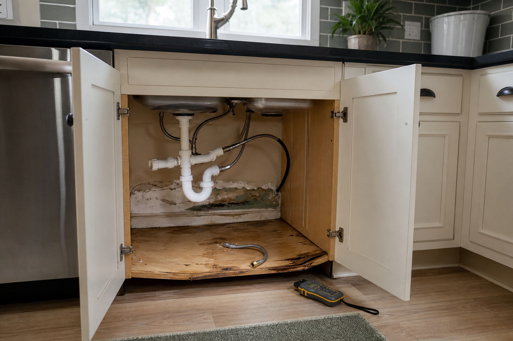

# Damage assessment

The failed supply line released water into the sink base and across the adjacent kitchen floor. The active leak was stopped on 2026-05-18; this note records the remaining physical damage relevant to the repair scope in [[status]].

*Synthetic inspection image used for this demo knowledge base. It illustrates how repository images render inline with ordinary Markdown.*

## Inspection summary

| Area | Observed condition | Repair implication |
|---|---|---|
| Sink-base cabinet | Base panel swollen and delaminated; staining at rear edge | Replace cabinet box; face frame may be reusable after inspection |
| Rear wall | Lower finish removed; localized water staining | Patch substrate after confirming dry readings |
| Flooring | Cupping extends approximately 1.2 m from sink toe-kick | Replace affected planks and blend to nearest transition |
| Supply line | Braided line separated near compression fitting | Preserve failed part and installation photos as evidence |

## Measurements

- **2026-06-02, adjuster visit:** surface readings within the dry standard at accessible locations.
- **2026-06-08, contractor visit:** no active moisture detected; cabinet deformation remains permanent.
- **Affected run:** sink base plus the immediately adjacent cabinet, subject to field verification during removal.

## What the image supports

1. The loss originated inside the sink base rather than from long-term exterior seepage.
2. The cabinet floor cannot be repaired cosmetically because the substrate has swollen and separated.
3. The wall and flooring require access during cabinet removal, supporting a coordinated rather than isolated repair scope.

## Open evidence requests

- Obtain the adjuster’s original full-resolution photographs.
- Ask [[Dana Whitfield]] to identify the cabinet quantities and depreciation assumptions in the carrier estimate.
- Add BlueOak’s annotated floor plan when received.
